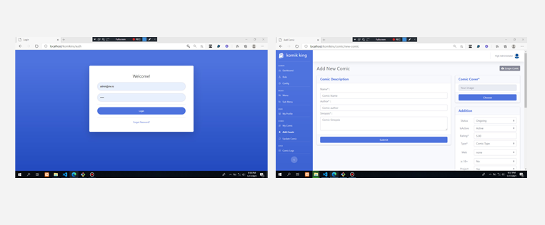
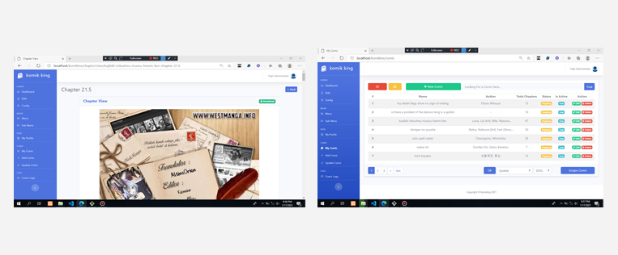

# Komikins - merupakan admin dashboard untuk indotaku

## Screenshots

## Setup application

Silahkan clone repository ini

	git clone https://github.com/CloudMyn/Indotaku-dashboard.git

Setelah berhasil, silahkan import database 'komik_backup.sql' ke lokal mesin anda

Setelah itu, silahkan lakukan konfigurasi database di path

> application/config/database.php

Selamat mencoba.
